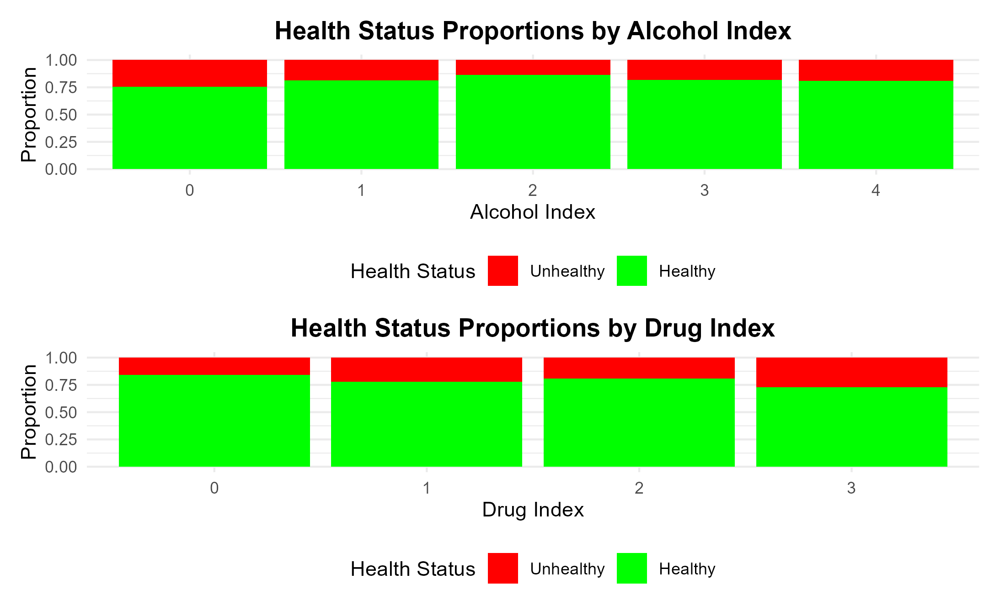
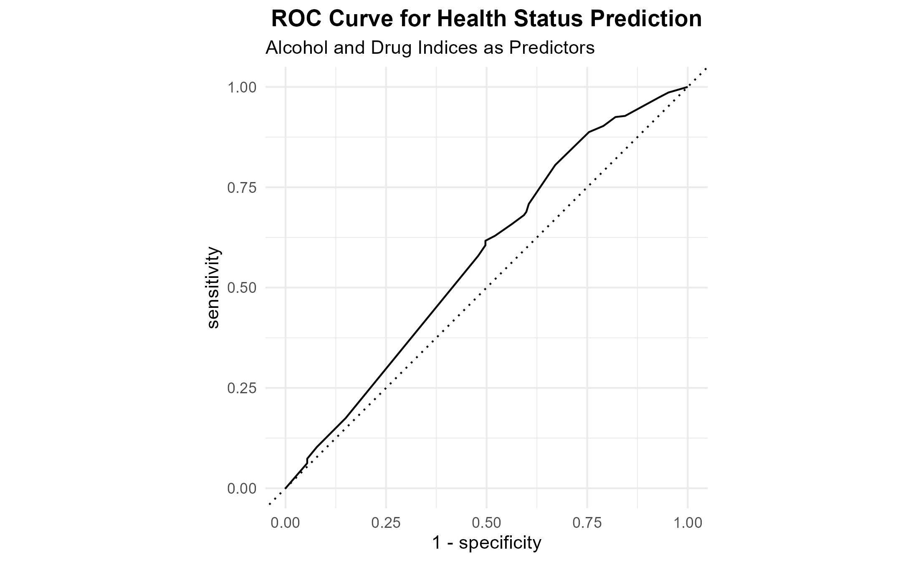
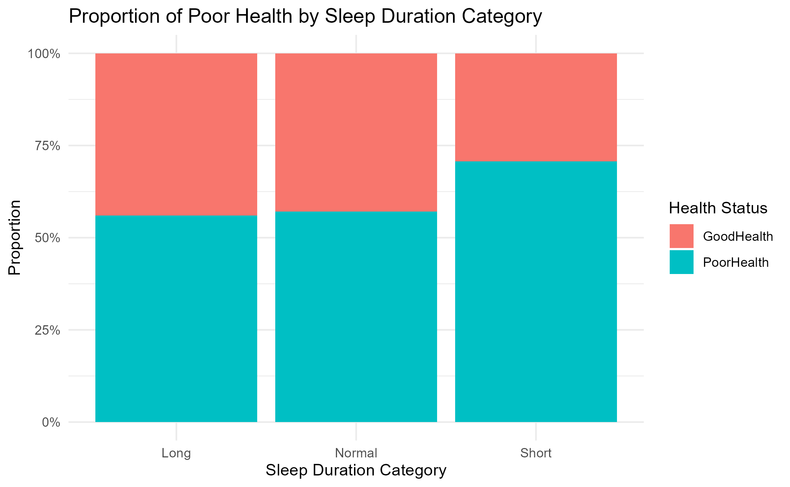
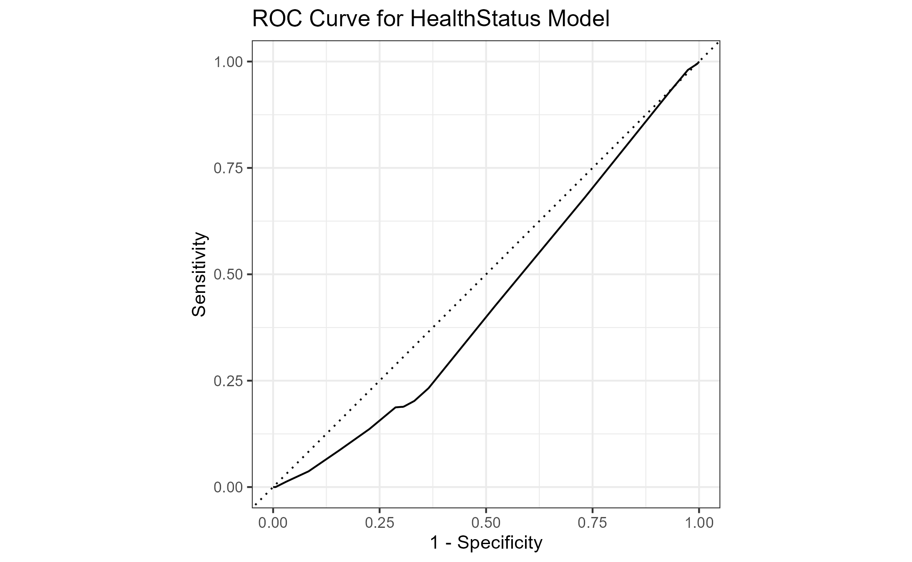

```{r install-package, include = FALSE, eval = FALSE}
# Copy and paste the following code into your console to download and install
# the `xaringan` package that contains all of the code which allows you 
# to create presentation slides in Rmarkdown
install.packages('xaringan')
```


```{r load-packages, include = FALSE}
# Add any additional packages you need to this chunk
library(tidyverse)
library(tidymodels)
library(palmerpenguins)
library(knitr)
library(xaringanthemer)
library(htmltools)
```

```{r setup, include=FALSE}
# For better figure resolution
knitr::opts_chunk$set(fig.retina = 3, dpi = 300, fig.width = 6, fig.asp = 0.618, out.width = "80%")
```

```{r load-data, include=FALSE}
# Load your data here

```

```{r include=FALSE}

#Background image
style_xaringan(
  title_slide_background_image = "img/confetti.jpg"
)
```

class: center, middle

## If we can predict people's health status?

---

# Proportions

```{r p2, echo = FALSE, out.width = "55%", fig.align = "center"}

```
---
#Prediction
```{r ip, echo = FALSE}
includeHTML("test_predictions.html")
```
---

# ROC

```{r p4, echo = FALSE, out.width = "55%", fig.align = "center"}

```
-AUC value:0.572
---
# Distribution 

```{r p5, echo = FALSE, out.width = "55%", fig.align = "center"}

```

---
# ROC

```{r p6, echo = FALSE, out.width = "55%", fig.align = "center"}

```

---


# Summary

- Purpose

- Method and Findings

- Future 
